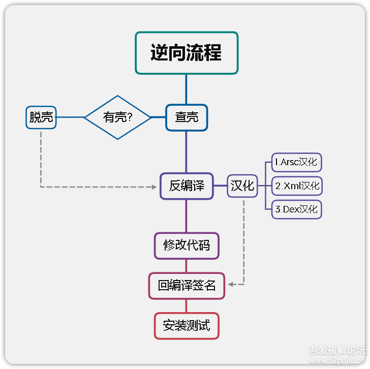
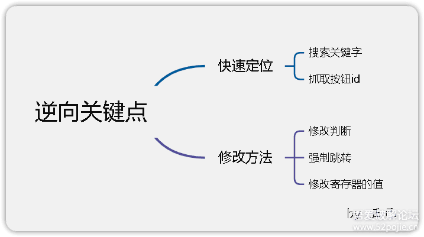

    参考 吾爱破解 官网教程

## APK基础

> 参考 [《安卓逆向这档事》二、初识APK文件结构、双开、汉化、基础修改](https://www.52pojie.cn/thread-1695796-1-1.html)

### Apk结构

+ **assets** 目录 : 存放APK的静态资源文件, 比如视频音频, 图片等
+ **lib** 目录 : armeabi-v7a基本通用所有android设备arm64-v8a只适用于64位的android设备, x86常见用于androi模拟器, 其目录下的.so文件是c或c++编译的动态链接库文件
+ **META-INF** 目录 : 保存应用的签名信息, 签名信息以验证APK文件的完整性, 相当于APK的身份证(验证文件是否被修改)
+ **res** 目录 :res目录存放资源文件, 包括图片, 字符等等, APK的脸蛋由他的layout文件设计
+ **AndroidManifest.xml** 文件 : APK的应用清单信息它描述了应用的名字, 版本, 权限, 引用的库文件等等信息
+ **classes.dex** 文件 : classes.dex是java源码编译生成的java字节码文件, APK运行的主要逻辑
+ **resources.arsc** 文件 : resources.arsc是编译后二进制资源文件, 它是一个映射表, 映射着资源和id, 通过R件中的id就可以找到对应的资源

### Apk双开

+ 修改包名
+ 其他见参考

### 汉化Apk

流程图如下:


+ 以**翻译模式**编辑**resources.arsc**
+ 进入 [DEFAULT] 然后利用插件一键翻译, 然后再进行微调

### 替换图片

1. 使用**开发助手**的布局查看功能查看图片**资源十六进制ID**
2. 使用**XML搜索**功能**资源ID**搜索模式搜索对应ID
3. 找到XML文件中对应ID的布局资源
4. 复制对应资源的图片SRC的资源ID
5. 使用**Asrc**编辑**resources.arsc**的ID定位资源功能到图片文件
6. 替换对应的图片文件即可

## Smali 修改

> 参考 [《安卓逆向这档事》三、初识smali，vip终结者](https://www.52pojie.cn/thread-1701353-1-1.html)

### 语法

+ const/4 赋值4比特位数据
+ const/16 赋值16比特位数据

见参考

### 实战修改

1. 通过关键字搜索或按钮ID快速定位需要修改的位置
2. 修改对应的smali代码改变逻辑



### 小技巧

+ 正则化搜索
  + `(.*) .*` 表达式即可匹配所有寄存器赋值语句，其中`(.*)`即为被赋值寄存器
  + `const/16 $1,0x7fff` 即可对匹配到的赋值寄存器进行赋值

## 弹窗以及广告的去除

> 参考 [《安卓逆向这档事》四、恭喜你获得广告&弹窗静默卡](https://www.52pojie.cn/thread-1706691-1-1.html)

### 启动广告

逻辑: 启动Activity -> 广告Activity -> 主页Activity

+ 法1:修改持续时间
    1. 使用MT的Activity记录功能获取广告Activity类名
    2. 使用**Dex++**编辑 **classes.dex**
    3. 按**类名**搜索 *第 i 步* 获得的类名
    4. 修改smali代码将持续时间设定为 0 即可
+ 法2:修改Activity跳转逻辑
    1. 使用MT的Activity记录功能获取广告Activity类名
    2. 使用**Dex++**编辑 **classes.dex**
    3. 按**类名**搜索 *第 i 步* 获得的类名
    4. 复制对应类smali代码中的标识符(长按复制最下面那个)
    5. 按**代码**搜索 *第 iv 步* 的标识符
    6. 找到除自己外的其他类中跳转逻辑
    7. 修改跳转逻辑跳转为指定的Activity(可同样通过搜索需要跳转的类名获得smali代码中对应Activity的标识符)

### 弹窗

若为更新弹窗, 可尝试直接修改**AndroidManifest.xml**的*versionCode*

其余弹窗按以下步骤

1. 定位
    + 直接**字符串**搜索dex文件中对应弹窗输出
    + 通过**算法助手**的*弹窗定位*功能定位弹窗被调用的方法, 然后通过**方法**搜索dex文件找到对应的位置
2. 修改
    + 注释掉smali语句中对应弹窗的show语句即可

### 布局广告

+ 使用**开发助手**的布局查看功能查看图片**资源ID**
+ 使用**XML搜索**功能**资源ID**搜索模式搜索对应ID
+ 找到XML文件中对应ID的布局资源
+ 将对应资源的宽高设置为0dp或者添`android:visibility="gone"`即可

```xml
修改:
android:layout_width="0.0dp"
android:layout_height="0.0dp"
隐藏:
android:visibility="gone"
```

## 动态调试&Log插桩

> 参考 [《安卓逆向这档事》五、1000-7=？&动态调试&Log插桩](https://www.52pojie.cn/thread-1714727-1-1.html)

### 动态调试

1. 获取debug权限
    + 在**AndroidManifest.xml**中添加 `android:debuggable="true"` 属性
    + 使用**XappDebug**模块hook对应的app
    + 通过刷入**MagiskHide Props Config**模块(永久)
2. 端口转发以及开启adb权限
    1. 进入开发者模式
    2. 开启usb调试模式
3. 使用adb启动debug的程序
    模板：`adb shell am start -D -n 包名/类名`
    例如：`adb shell am start -D -n com.zj.wuaipojie/.ui.MainActivity`
    参数解释：`-D`表示调试模式，`-n`用于指定启动的包名和类名
4. 使用**Jeb**附加调试进程
    1. 使用**Jeb**打开apk
    2. 通过关键字查找需要调试的位置
    3. 打断点(`ctrl+b`)
    4. 使用debug模式启动程序
    5. 将程序运行到断点处，然后就可以在**Jeb**中查看变量值了

### Log插桩

1. 将*日志插桩2.dex*放入apk包中
2. 将该dex文件重命名为*classes2.dex*(其中数字根据classes个数修改)
3. 使用**Dex++**编辑 **classes.dex**
4. 查找到需要修改的位置后，修改smali代码
    `invoke-static {对应寄存器}, Lcom/mtools/LogUtils;->v(Ljava/lang/Object;)V`
    通过以上加入以上代码到指定位置即可
5. 通过**算法助手**的Log捕获功能捕获日志即可获取对应寄存器值

## 签名校验及对抗

> 参考 [《安卓逆向这档事》六、校验的N次方-签名校验对抗、PM代{过}{滤}理、IO重定向](https://www.52pojie.cn/thread-1731181-1-1.html)

### 签名校验

1. 判断是否存在签名校验
    1. 不做任何修改，直接进行签名安装
    2. 程序闪退或黑屏则说明存在签名校验
2. 定位签名校验及修改
    1. 法1
        1. 直接签名安装
        2. 使用**算法助手**的*拦截应用退出*和*防止应用闪退*功能拦截闪退
        3. 通过日志查找定位闪退原因，以下列举几种可能的标志
            + kill/killProcess-----kill/KillProcess()可以杀死当前应用活动的进程，这一操作将会把所有该进程内的资源（包括线程）*全部清理*掉.当然，由于ActivityManager时刻监听着进程，一旦发现进程被非正常Kill，它将会试图去重启这个进程。这就是为什么，有时候当我们试图这样去结束掉应用时，发现它又自动重新启动的原因.
            + system.exit-----*杀死了整个进程*，这时候活动所占的资源也会被释放。
            + finish----------仅仅针对Activity，当调用finish()时，只是将活动推向后台，并没有立即释放内存，*活动的资源并没有被清理*
        4. 注释掉使得进程关闭的语句即可
    2. 法2:
        1. 直接使用**算法助手**的*读取应用签名监听*功能
        2. 通过日志查找定位调用读取应用签名位置
        3. 直接修改其比对逻辑或签名后找到重新计算出的签名替换原签名即可

### 签名校验对抗

+ **核心破解**插件，其可以不签名直接安装应用
+ 一键过签名工具，如MT、NP、ARMPro、CNFIX、Modex等的去除签名校验功能
+ 具体分析签名校验逻辑
+ io重定向

### 手动实现PM代理

已过时，简单了解即可。见参考。

### IO重定向

+ 作用
  + 可以让文件只读、不可写
  + 禁止访问文件
  + 路径替换
+ 示例
  + 过签名检测：让软件读取签名时读取原包（未修改的包）
  + 风控对抗：有些软件读取软件启动次数，通过IO重定向指向我们指定的文件
  + 过Root检测，Xposed检测：让对应文件不可读，读不到就被认定为不存在

`此部分设计大量源码相关内容，目前小白还是看不太懂，未来再慢慢学习`

### 过Root检测

+ 找到对应的root检测方法修改逻辑
+ 使用**算法助手**隐藏root
+ 使用IO重定向

### 反模拟器检测及反调试检测

见参考

## Hook

> 参考 [《安卓逆向这档事》七、Sorry，会Hook真的可以为所欲为-Xposed快速上手(上)](https://www.52pojie.cn/thread-1740944-1-1.html)
> 参考 [《安卓逆向这档事》八、Sorry，会Hook真的可以为所欲为-xposed快速上手(下)快速hook](https://www.52pojie.cn/thread-1748081-1-1.html)

### 基础Hook

1. 创建Android空项目
2. 将`xposedBridgeApi.jar`包加入`libs`文件夹下并右键`Add as library`
3. 修改`AndroidManifest.xml`在`application`标签下添加以下代码

    ```xml
    <!-- 是否是xposed模块，xposed根据这个来判断是否是模块 -->
    <meta-data
        android:name="xposedmodule"
        android:value="true" />
    <!-- 模块描述，显示在xposed模块列表那里第二行 -->
    <meta-data
        android:name="xposeddescription"
        android:value="这是一个Xposed模块" />
    <!-- 最低xposed版本号(lib文件名可知) -->
    <meta-data
        android:name="xposedminversion"
        android:value="89" />
    ```

4. 在项目的`build.gradle`中的`dependencies`中添加以下代码`compileOnly files('./libs/XposedBridgeAPI-89.jar')`
5. 新建Hook类,实现IXposedHookLoadPackage接口,然后在handleLoadPackage函数内编写Hook逻辑(以下给出示例Hook类代码)
6. 新建-->Folder-->Assets Folder,创建xposed_init:只有一行代码，就是说明入口类。例如:`com.example.demo.Hook`

```java
package com.example.demo;
import android.app.Application;
import android.content.Context;
import android.util.Log;
import de.robv.android.xposed.*;
import de.robv.android.xposed.callbacks.XC_LoadPackage;

import java.lang.reflect.Field;
import java.lang.reflect.Method;
import java.lang.reflect.Modifier;
import java.lang.reflect.Parameter;

public class Hook implements IXposedHookLoadPackage {
    final static String TAG = "LeoJoy";

    @Override
    public void handleLoadPackage(XC_LoadPackage.LoadPackageParam loadPackageParam) throws Throwable {
        if(!loadPackageParam.packageName.equals("com.zj.wuaipojie")){
            return;
        }

        // Hook普通函数，可直接通过 jadx 复制为xposed模式。 其需要给出参数的类型，故不适合Hook复杂参数以及自定义参数
        // 若需要Hook内部类，直接在外部类后添加 $ 后添加类名即可，例如：com.zj.wuaipojie.Demo$InnerClass
        XposedHelpers.findAndHookMethod("com.zj.wuaipojie.Demo", loadPackageParam.classLoader, "a", String.class, new XC_MethodHook() {
            @Override
            protected void beforeHookedMethod(MethodHookParam param) throws Throwable {
                super.beforeHookedMethod(param);
                // 修改参数

                Log.d(TAG, "未修改前:" + param.args[0].toString());
                // XposedBridge.log(param.args[0].toString());
                param.args[0] = "changed";
                Log.d(TAG, "修改后:" + param.args[0]);
            }
            @Override
            protected void afterHookedMethod(MethodHookParam param) throws Throwable {
                super.afterHookedMethod(param);
                // 修改返回值

                Log.d(TAG, param.getResult().toString());
                param.setResult("123456");
            }
        });

        // Hook复杂参数的函数
        Class clazz = XposedHelpers.findClass("com.zj.wuaipojie.Demo", loadPackageParam.classLoader); // 需要Hook的类： 包名+类
        // Class clazz = loadPackageParam.classLoader.loadClass("com.zj.wuaipojie.Demo"); 也可，上面的是Xposed封装函数，带错误处理
        XposedBridge.hookAllMethods(clazz, "complexParameterFunc", new XC_MethodHook() { // 指定需要Hook的方法
            @Override
            protected void beforeHookedMethod(MethodHookParam param) throws Throwable {
                super.beforeHookedMethod(param);
                Log.d(TAG, "before:" + param.args[0].toString());
            }
        });

        // Hook 替换函数
        // Class clazz = XposedHelpers.findClass("com.zj.wuaipojie.Demo", loadPackageParam.classLoader);
        XposedBridge.hookAllMethods(clazz,"repleaceFunc",new XC_MethodReplacement() {
            @Override
            protected Object replaceHookedMethod(MethodHookParam methodHookParam) throws Throwable {
                // 替换函数
                Log.d(TAG, "替换函数能输出吗？");
                // 例如： 可替换一个弹出弹窗的一个函数，以避免弹窗
                return "";
            }
        });

        // Hook 加固通杀 基本破除所有免费的加固
        XposedHelpers.findAndHookMethod(Application.class, "attach", Context.class, new XC_MethodHook() {
            @Override
            protected void afterHookedMethod(MethodHookParam param) throws Throwable {
                Context context = (Context) param.args[0];
                ClassLoader classLoader = context.getClassLoader();
                // 因大部分软件存在加固，故需要这样获得classLoader
                // 在此处添加Hook逻辑
            }
        });

        // Hook变量
        // 静态变量
        // Class clazz = XposedHelpers.findClass("com.zj.wuaipojie.Demo", loadPackageParam.classLoader);
        XposedHelpers.setStaticObjectField(clazz, "staticField", "静态变量Hook"); // 此处根据变量类型选择对应的set方法
        // 非静态变量
        XposedBridge.hookAllConstructors(clazz, new XC_MethodHook() { // 因大多此类变量均在构造函数中初始化
            @Override
            protected void afterHookedMethod(MethodHookParam param) throws Throwable {
                super.afterHookedMethod(param);
                //param.thisObject获取当前所属的对象
                Object ob = param.thisObject;
                XposedHelpers.setIntField(ob,"privateInt",1234);
                XposedHelpers.setIntField(ob,"publicInt",4567);
            }
        });

        // Hook构造函数
        XposedHelpers.findAndHookConstructor("com.zj.wuaipojie.Demo", loadPackageParam.classLoader, new XC_MethodReplacement() {
            @Override
            protected Object replaceHookedMethod(MethodHookParam methodHookParam) throws Throwable {
                return "";
            }
        });
        // 带参构造函数
        XposedHelpers.findAndHookConstructor("com.zj.wuaipojie.Demo", loadPackageParam.classLoader, String.class, new XC_MethodHook() {
            @Override
            protected void beforeHookedMethod(MethodHookParam param) throws Throwable {
                super.beforeHookedMethod(param);
                param.args[0] = "好的";
            }
        });

        // 主动调用
        // 静态方法
        // Class clazz = XposedHelpers.findClass("com.zj.wuaipojie.Demo",loadPackageParam.classLoader);
        // XposedHelpers.callStaticMethod(clazz,"staticPrivateFunc");
        // 非静态方法
        XposedHelpers.callMethod(clazz.newInstance(), "privateFunc", "666"); // 666为传入的参数值

        // 反射 即在当前类中调用其他类中的方法
        // Class clazz = XposedHelpers.findClass("com.zj.wuaipojie.Demo", loadPackageParam.classLoader);
        XposedHelpers.findAndHookMethod("com.zj.wuaipojie.Demo$InnerClass", loadPackageParam.classLoader, "innerFunc",String.class,  new XC_MethodHook() {
            @Override
            protected void beforeHookedMethod(MethodHookParam param) throws Throwable {
                super.beforeHookedMethod(param);
                //第一步找到类
                //找到方法，如果是私有方法就要setAccessible设置访问权限
                //invoke主动调用或者set修改值(变量)
                Class democlass = Class.forName("com.zj.wuaipojie.Demo",false,loadPackageParam.classLoader);
                Object ob = clazz.newInstance();
                Field p = democlass.getDeclaredField("publicInt");
                p.setAccessible(true);
                p.setInt(ob,78910);
                Method demomethod = democlass.getDeclaredMethod("refl");
                demomethod.setAccessible(true); // 若为私有函数，需设置为可访问
                demomethod.invoke(ob);
            }
        });
    }
}
```

### Hook妙用

+ 字符串定位
代码：

```java
    // 字符串赋值定位
    XposedHelpers.findAndHookMethod("android.widget.TextView", loadPackageParam.classLoader, "setText", CharSequence.class, new XC_MethodHook() {
        @Override
        protected void beforeHookedMethod(MethodHookParam param) throws Throwable {
            super.beforeHookedMethod(param);
            Log.d(TAG,param.args[0].toString());
            if(param.args[0].equals("wuaipojie")){
                printStackTrace();
            }
        }
    });

// 在Hook类外定义
private static void printStackTrace() {
    Throwable ex = new Throwable();
    StackTraceElement[] stackElements = ex.getStackTrace();
    for (int i = 0; i < stackElements.length; i++) {
        StackTraceElement element = stackElements[i];
        Log.d(TAG,"at " + element.getClassName() + "." + element.getMethodName() + "(" + element.getFileName() + ":" + element.getLineNumber() + ")");
    }
}
```

+ 点击事件监听
代码：

```java
// 点击事件监听
Class btnClick = XposedHelpers.findClass("android.view.View", loadPackageParam.classLoader);
XposedBridge.hookAllMethods(btnClick, "performClick", new XC_MethodHook() {
    @Override
    protected void afterHookedMethod(MethodHookParam param) throws Throwable {
        super.afterHookedMethod(param);
        Object listenerInfoObject = XposedHelpers.getObjectField(param.thisObject, "mListenerInfo");
        Object mOnClickListenerObject = XposedHelpers.getObjectField(listenerInfoObject, "mOnClickListener");
        String callbackType = mOnClickListenerObject.getClass().getName();
        Log.d(TAG,callbackType);
    }
});
```

+ 改写布局
见参考

### 免root注入

即将开发的xposed模块注入到软件中，这样软件即可在未授予root权限的情况下，使用xposed模块。

1. 将模块打包成apk
    1. Idea依次选择*Build*，*Generate Signed Bundle or Apk*，*APK*
    2. 选择密钥，release版本，签名，finish即可
2. 使用**LSPatch**应用修补功能, 选择便携模式，嵌入对应的模块，然后开始修补即可获得对应的安装包

### SimpleHook

该插件可以实现简单的Hook
> 参考 [SimpleHook](https://github.com/littleWhiteDuck/SimpleHook)

1. 在smali代码页面进入导航栏长按复制方法签名
2. 粘贴入SimpleHook中自动识别配置
3. 按需调整配置
4. 运行SimpleHook，即可在日志中查看Hook结果

## 密码学

> 参考 [《安卓逆向这档事》九、密码学基础、算法自吐、非标准加密对抗](https://www.52pojie.cn/thread-1762225-1-1.html)
> 参考 [加解密大杂烩](https://gchq.github.io/CyberChef/)

### 常见编码

在搜索不到关键字时，可尝试使用以下编码后的密文进行搜索

+ Base64编码
+ Hex编码
+ UniCode编码
+ Byte数组

### 加密算法

+ 消息摘要算法&单向散列函数&哈希算法 **MD5**
+ 对称加密算法 **DES**,**AES**等等
+ 非对称加密算法 **RSA**

可使用**算法助手**或者**SimpleHook**实现加解密算法的读取(只能读取调用系统库的加解密功能)

若出现自定义加解密算法，则可使用以下方法

+ Hook主动调用
+ 将反编译的代码拿出来进行运行
+ 问ChatGPT

## IDA(so文件)

> 参考 [《安卓逆向这档事》十、不是我说，有了IDA还要什么女朋友？](https://www.52pojie.cn/thread-1787667-1-1.html)

### NDK开发

1. 安装NDK以及CMake
2. 新建Native C++项目
3. 即可使用JNI调用C++实现对应函数

### 使用IDA进行反编译

`现阶段来说还是比较困难，见参考吧`
